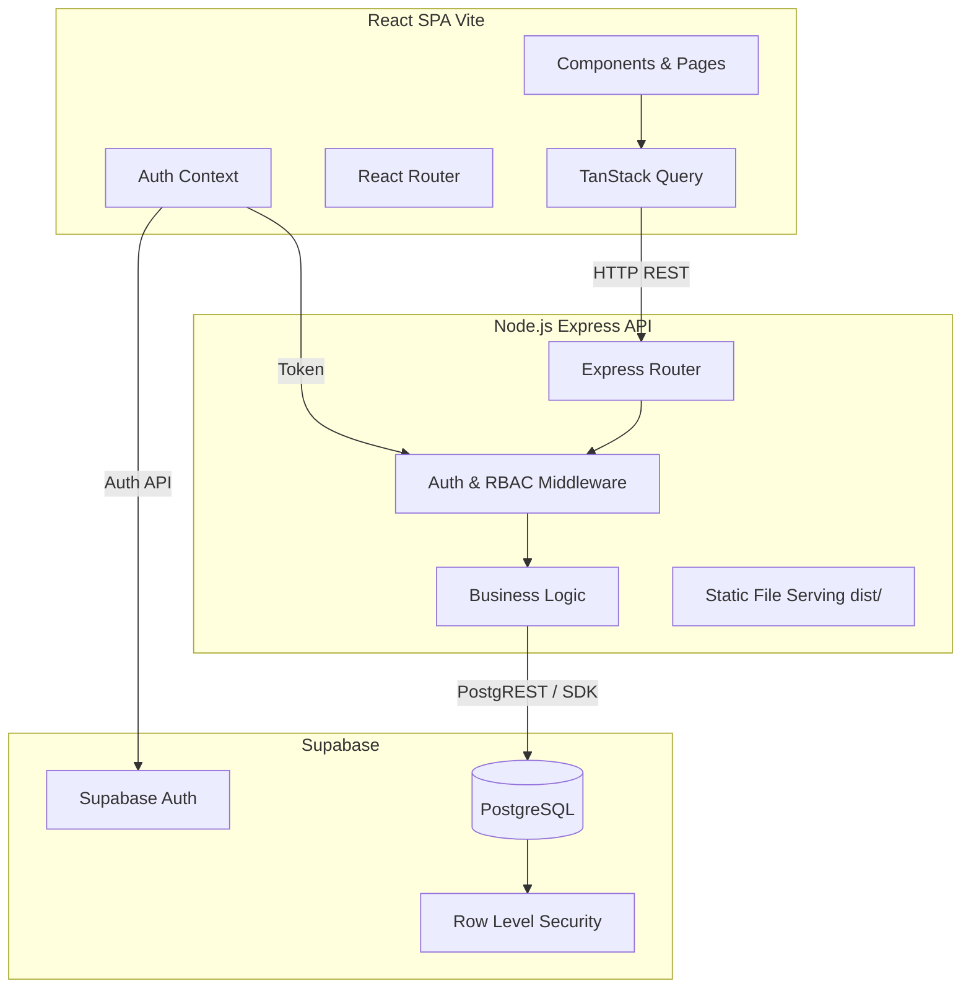

# System Architecture Diagram

```mermaid
graph TD
    subgraph Frontend [React SPA Vite]
        UI[Components & Pages]
        State[TanStack Query]
        Router[React Router]
        AuthUI[Auth Context]
    end

    subgraph Backend [Node.js Express API]
        RouterAPI[Express Router]
        Middleware[Auth & RBAC Middleware]
        Services[Business Logic]
        Static[Static File Serving dist/]
    end

    subgraph Database [Supabase]
        AuthDB[Supabase Auth]
        Postgres[(PostgreSQL)]
        RLS[Row Level Security]
    end

    UI --> State
    State -->|HTTP REST| RouterAPI
    AuthUI -->|Token| Middleware
    RouterAPI --> Middleware
    Middleware --> Services
    Services -->|PostgREST / SDK| Postgres
    AuthUI -->|Auth API| AuthDB
    Postgres --> RLS
```
