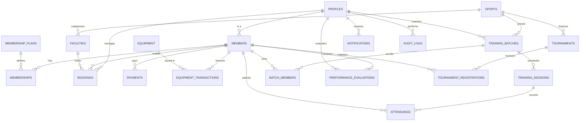

# Entity-Relationship Diagram (ERD)

```mermaid
erDiagram
    PROFILES ||--o{ MEMBERS : "is a"
    MEMBERS ||--o{ MEMBERSHIPS : has
    MEMBERSHIP_PLANS ||--o{ MEMBERSHIPS : defines
    
    PROFILES ||--o{ BOOKINGS : manages
    MEMBERS ||--o{ BOOKINGS : makes
    FACILITIES ||--o{ BOOKINGS : hosts
    SPORTS ||--o{ FACILITIES : categorizes

    MEMBERS ||--o{ PAYMENTS : pays
    MEMBERS ||--o{ EQUIPMENT_TRANSACTIONS : borrows
    EQUIPMENT ||--o{ EQUIPMENT_TRANSACTIONS : "issued in"
    
    SPORTS ||--o{ TRAINING_BATCHES : groups
    PROFILES ||--o{ TRAINING_BATCHES : coaches
    TRAINING_BATCHES ||--o{ TRAINING_SESSIONS : schedules
    TRAINING_BATCHES ||--o{ BATCH_MEMBERS : enrolls
    MEMBERS ||--o{ BATCH_MEMBERS : joins
    TRAINING_SESSIONS ||--o{ ATTENDANCE : records
    MEMBERS ||--o{ ATTENDANCE : attends
    
    MEMBERS ||--o{ PERFORMANCE_EVALUATIONS : receives
    PROFILES ||--o{ PERFORMANCE_EVALUATIONS : evaluates

    SPORTS ||--o{ TOURNAMENTS : features
    TOURNAMENTS ||--o{ TOURNAMENT_REGISTRATIONS : receives
    MEMBERS ||--o{ TOURNAMENT_REGISTRATIONS : registers

    PROFILES ||--o{ NOTIFICATIONS : receives
    PROFILES ||--o{ AUDIT_LOGS : performs
```
